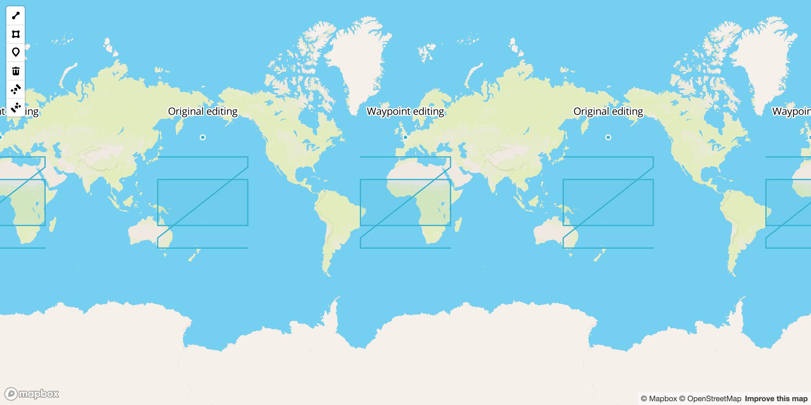

# mapbox-gl-draw-waypoint

[](https://www.npmjs.com/package/mapbox-gl-draw-waypoint)
[](https://www.npmjs.com/package/mapbox-gl-draw-waypoint)
[](https://www.npmjs.com/package/mapbox-gl-draw-waypoint)

Waypoint plugin for Mapbox GL Draw. It allows user to drag vertices only, prevents dragging features. Also, it merges UX of simple_select and direct_select modes together, to save mouse clicks when switching between them.

[Demo](https://zakjan.github.io/mapbox-gl-draw-waypoint/)



Supported Mapbox GL Draw modes:

- simple_select
  - clicking an inactive polygon/line feature switches to direct_select mode, saves one mouse click
  - multi-selection is prevented for consistency with direct_select mode
- direct_select
  - clicking an inactive feature selects it (point feature in simple_select mode, polygon/line feature in direct_select mode), saves one mouse click
  - dragging a polygon/line feature is prevented

## Install

```
npm install mapbox-gl-draw-waypoint
```

or

```
<script src="https://unpkg.com/mapbox-gl-draw-waypoint@1.2.0/dist/mapbox-gl-draw-waypoint.umd.min.js"></script>
```

## Usage

This plugin exposes a single function `enable`, which should be used to patch the original `MapboxDraw.modes` object.

```
import MapboxDraw from 'mapbox-gl-draw';
import * as MapboxDrawWaypoint from 'mapbox-gl-draw-waypoint';

let modes = MapboxDraw.modes;
modes = MapboxDrawWaypoint.enable(modes);
const draw = new MapboxDraw({ modes });
```

The second argument to `MapboxDrawWaypoint.enable` is a function to select features which should have the plugin enabled (defaults to all).

```
modes = MapboxDrawWaypoint.enable(modes, feature => feature.properties.risk);
```

The patching method is compatible with [mapbox-gl-draw-geodesic](https://github.com/zakjan/mapbox-gl-draw-geodesic), both patches can be used together.

```
import MapboxDraw from 'mapbox-gl-draw';
import * as MapboxDrawGeodesic from 'mapbox-gl-draw-geodesic';
import * as MapboxDrawWaypoint from 'mapbox-gl-draw-waypoint';

let modes = MapboxDraw.modes;
modes = MapboxDrawGeodesic.enable(modes);
modes = MapboxDrawWaypoint.enable(modes);
const draw = new MapboxDraw({ modes });
```

## Sponsors

<a href="https://maritrace.com/"></a>
